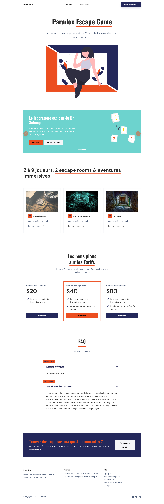
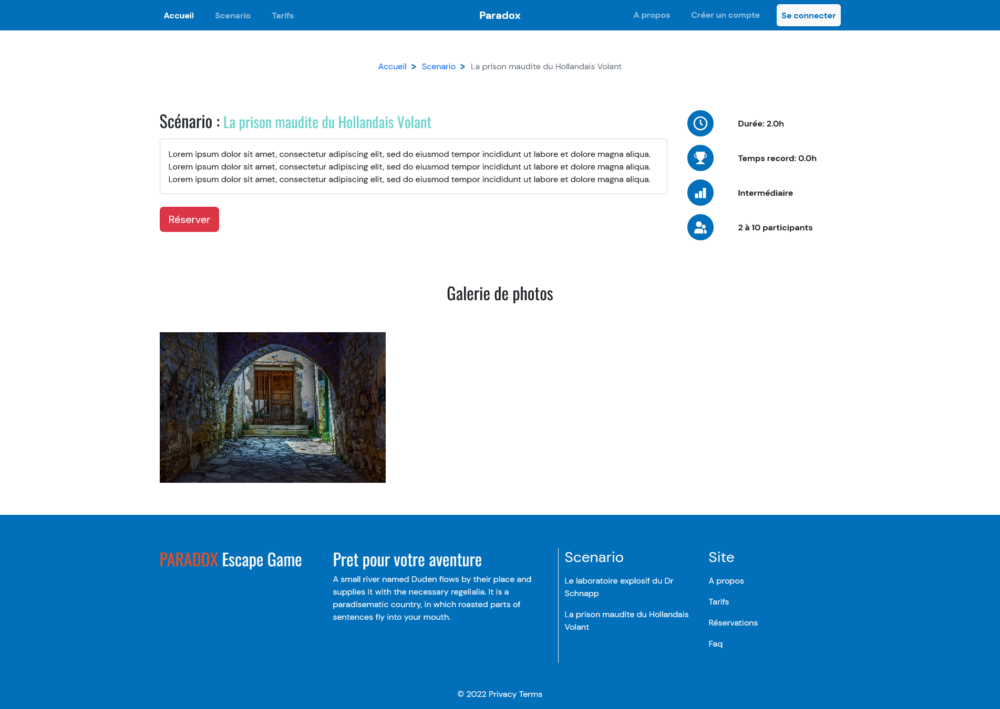
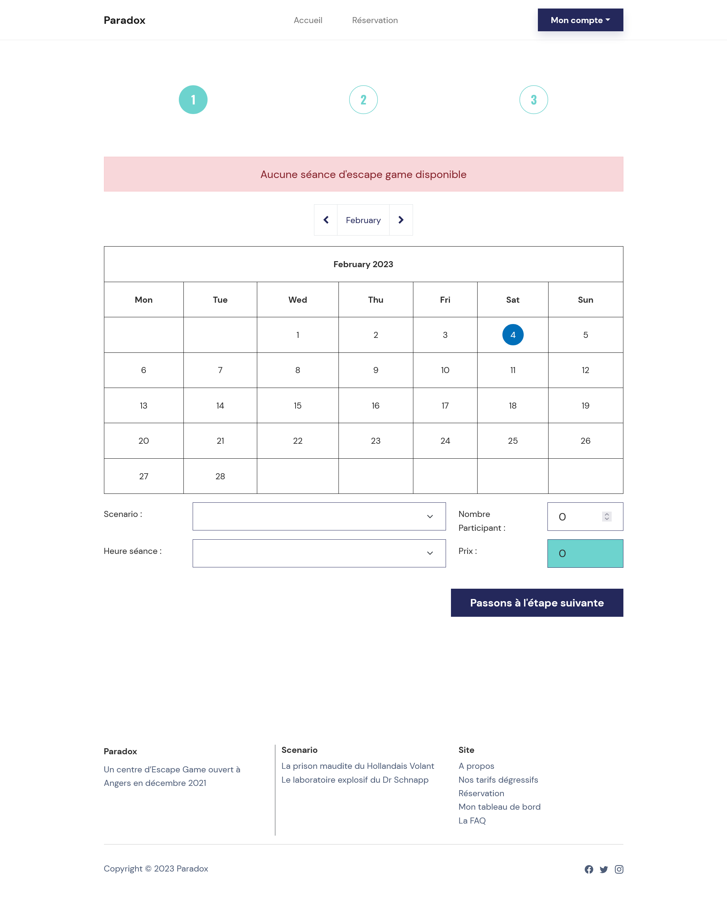

# Escape Game

Il est constitué de 3 parties à savoir : 
- une application web : reservations des séances
- une application mobile : lancement des parties
- une application desktop : surveillances des parties

Ce projet est un outil de reservation d'escape game. 

[lien de la version en ligne](https://cedricauc.alwaysdata.net/) 


Le projet web Escape Game consiste au développement d'une application python, 
une api REST et une base de donnée relationnelle pour permettre la réservation en ligne de séances d'Escape Game.
Les séances ainsi que les scénarios et la FAQ sont gérés depuis l'interface d’administration automatique de Django.

## Pré-requis

Pour l'application web : 
- [Python](https://www.python.org/downloads/) : back-end
- [bootstrap](https://getbootstrap.com/docs/5.2/getting-started/download/) : front
- [PostGreSQL 15](https://www.postgresql.org/download/) : SGBD


## Installation

- A la racine du projet, lancez les commandes 
```python
pip install virtualenv
python -m venv env
./env/Scripts/activate
pip install -r requirements.txt
```

## Utilisation

Commandes pour lancer le serveur Django
```python
python manage.py makemigrations 
python manage.py migrate
python manage.py createsuperuser
python manage.py loaddata fixtures.json
python manage.py runserver
```

Lancement de l'application en local.\
Ouvrir [http://localhost:8000](http://localhost:8000) pour afficher dans le navigateur.

Lancement de la console d'administration de l'application en local.\
Ouvrir [http://localhost:8000/admin](http://localhost:8000/admin) pour afficher dans le navigateur.

## Test du projet Python

Commandes pour lancer les tests
```python
pytest
```

Commandes pour lancer la couverture de test
```python
pytest --cov=.
```

## Visuel de l'application

**Page d'accueil**


**Page d'un scénario**


**Page de réservation**

