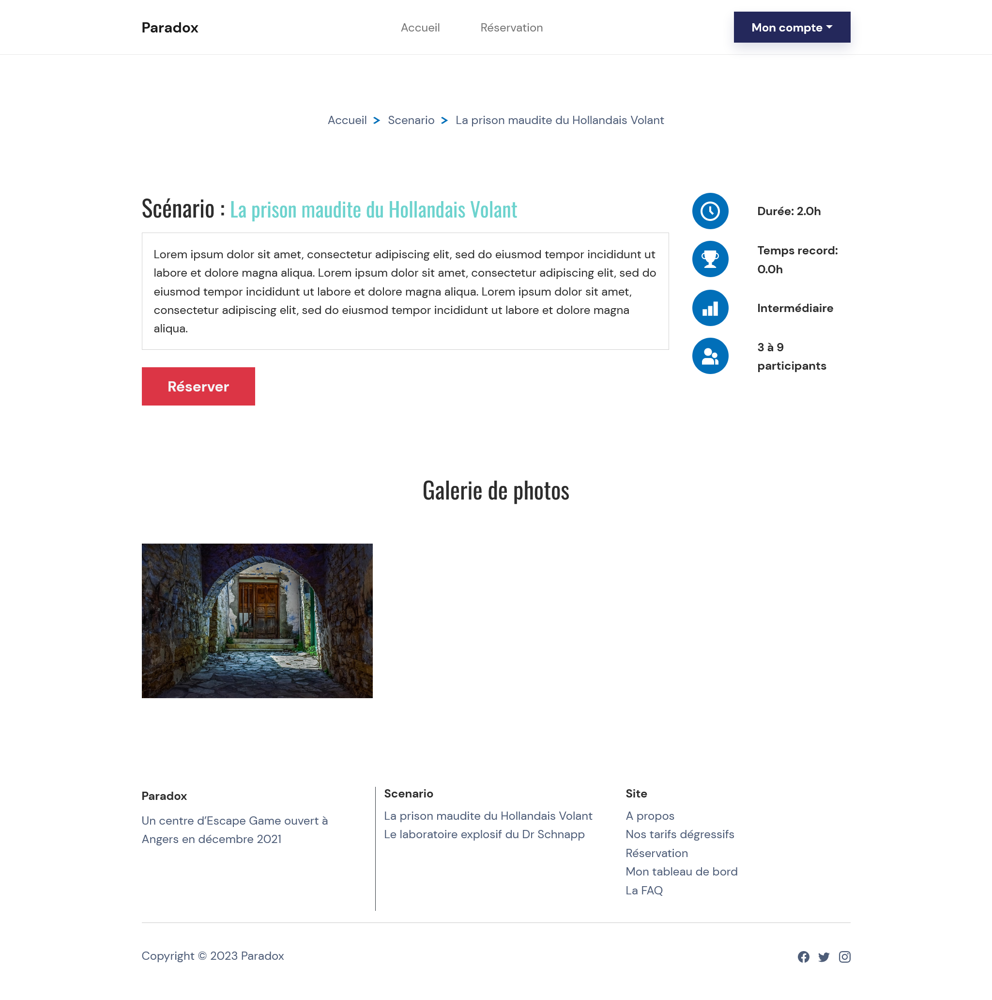

# Escape Game

Ce projet est un outil de reservation d'escape game. 

//lien déploiement 

Il est constitué de 3 parties à savoir : 
- une application web : reservations des séances
- une application mobile : lancement des parties
- une application desktop : surveillances des parties

Le projet web Escape Game est une application Python développer avec le framework Django. \
Le projet présente les séances d'Escape Game du centre Paradox et permet la réservation d'une séance d'un utilisateur authentifié.
Les séances ainsi que les scénarios et la FAQ sont gérés depuis l'interface d’administration automatique de Django.

## Pré-requis

Pour l'application web : 
- [Python](https://www.python.org/downloads/) : back-end
- [bootstrap](https://getbootstrap.com/docs/5.2/getting-started/download/) : front
- [PostGreSQL 15](https://www.postgresql.org/download/) : SGBD


## Installation

- A la racine du projet, lancez les commandes 
```python
pip install virtualenv
python -m venv env
./env/Scripts/activate
pip install -r requirements.txt
```

## Utilisation

Commandes pour lancer le serveur Django
```python
python manage.py makemigrations 
python manage.py migrate
python manage.py createsuperuser
python manage.py loaddata fixtures.json
python manage.py runserver
```

Lancement de l'application en local.\
Ouvrir [http://localhost:8000](http://localhost:8000) pour afficher dans le navigateur.

Lancement de la console d'administration de l'application en local.\
Ouvrir [http://localhost:8000/admin](http://localhost:8000/admin) pour afficher dans le navigateur.

**Identification interface d’administration:**\
utilisateur: admin\
mot de passe: admin

**Identification application:**\
utilisateur: client@gmail.com\
mot de passe: client

Commandes pour lancer les tests
```python
pytest
```

## Visuel de l'application

**Page d'accueil**


**Page d'un scénario**


**Page de réservation**


